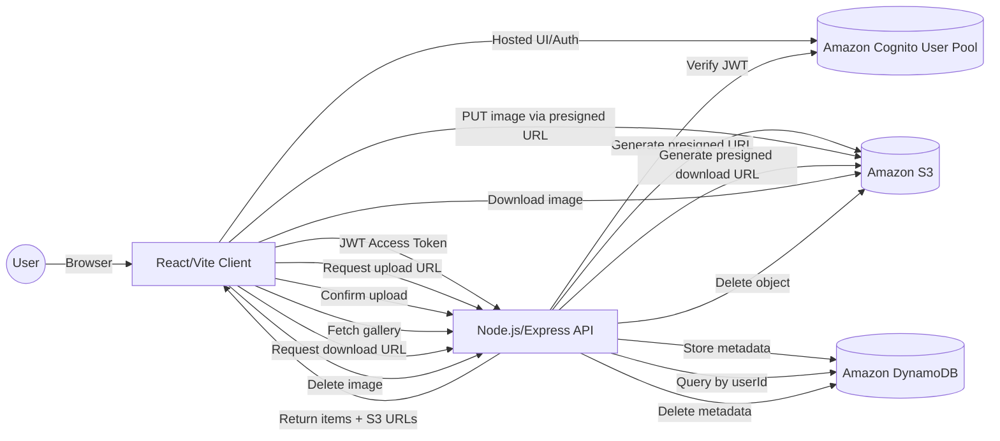

# High-Level Design (HLD) — Smart Gallery

## Overview
Smart Gallery is a web application for uploading images to cloud storage and browsing them with metadata generated by backend services. The system is composed of a React/Vite frontend, a Node.js/Express API, and AWS managed services for authentication and storage.

## HLD Diagram

## Key Flows
- **Authentication**: The client signs users in via Amazon Cognito and receives JWT access tokens.
- **Upload**: The client requests a presigned upload URL from the API, uploads directly to S3, then confirms the upload so metadata can be stored in DynamoDB.
- **Browse/Search**: The client fetches the gallery from the API, which queries DynamoDB by userId and returns items with S3 URLs and tags.
- **Download**: The client requests a presigned download URL from the API and downloads directly from S3.
- **Delete**: The client requests deletion; the API removes the S3 object and its DynamoDB entry.
